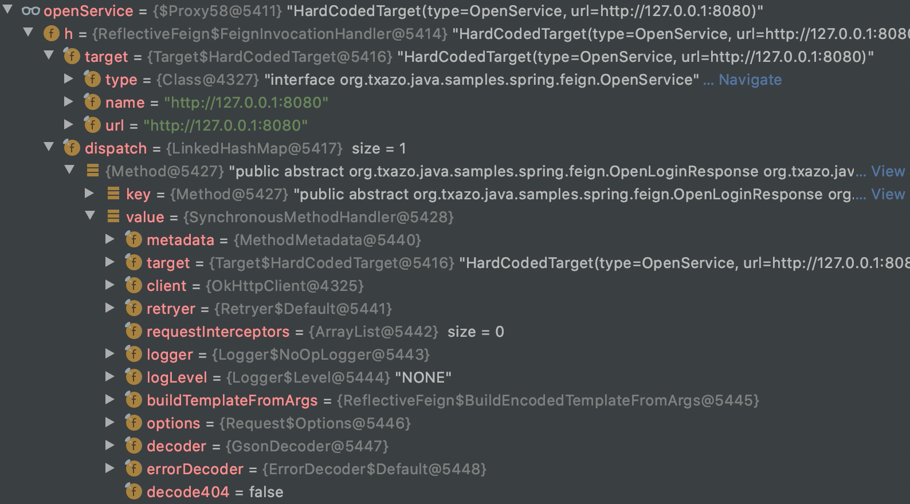

### 远程调用

#### HttpURLConnection

> jdk自带的Http工具类

#### HttpClient & OkHttp

> 第三方提供的Http客户端，两者提供的功能比较类似

##### 核心功能

* 支持完整的`Http请求`和Http`响应`协议
* 支持`同步`、`异步`请求
* 使用`连接池`管理连接
* 支持`超时设置`、`重试`，HttpClient支持请求级别的超时设置

#### RestTemplate

> Spring提供的访问`Restful API`的Http客户端

* `GET`: getForObject、getForEntity
* `HEAD`: headForHeaders
* `POST`: postForLocation、postForObject、postForEntity
* `PUT`: put
* `PATCH`: patchForObject
* `DELETE`: delete
* `OPTIONS`: optionsForAllow
* `EXCHANGE`: exchange
* `execute`: 通用请求方法

##### 底层Http实现

RestTemplate底层支持多种Http请求实现，可以通过`ClientHttpRequestFactory`实现类扩展

* `HttpURLConnection`: 默认实现，SimpleClientHttpRequestFactory
* `HttpClient`: HttpComponentsClientHttpRequestFactory
* `OkHttp`: OkHttp3ClientHttpRequestFactory
* `Netty`: Netty4ClientHttpRequestFactory

##### RestTemplate + OkHttp

```java
@Bean
public OkHttpClient okHttpClient() {
    return new OkHttpClient().newBuilder()
            .connectTimeout(3000, TimeUnit.MILLISECONDS)
            .build();
}

@Bean
public RestTemplate restTemplate(OkHttpClient okHttpClient) {
    return new RestTemplate(new OkHttp3ClientHttpRequestFactory(okHttpClient));
}
```

#### Feign

> Netflix开发的一个`声明式`的Http客户端

* Feign的对象编码解码支持Gson、Jackson
* Feign的http请求支持HttpURLConnection(默认)、HttpClient、OkHttp
* Feign可集成Hystrix实现限流熔断降级
* Feign可集成Ribbon实现负载均衡

##### Feign + SpringBoot

引入Feign相关jar包

```xml
<dependency>
    <groupId>com.netflix.feign</groupId>
    <artifactId>feign-core</artifactId>
    <version>8.18.0</version>
</dependency>

<dependency>
    <groupId>com.netflix.feign</groupId>
    <artifactId>feign-gson</artifactId>
    <version>8.18.0</version>
</dependency>

<dependency>
    <groupId>com.netflix.feign</groupId>
    <artifactId>feign-okhttp</artifactId>
    <version>8.18.0</version>
</dependency>

<dependency>
    <groupId>com.google.code.gson</groupId>
    <artifactId>gson</artifactId>
    <version>2.8.6</version>
</dependency>

<dependency>
    <groupId>com.squareup.okhttp3</groupId>
    <artifactId>okhttp</artifactId>
    <version>3.14.9</version>
</dependency>
```

定义Feign客户端接口

```java
public interface OpenService {

    @RequestLine("POST /open/login")
    @Headers({"Content-Type: application/json"})
    OpenLoginResponse openLogin(OpenLoginRequest request);

}
```

Feign客户端配置

```java
@Configuration
public class FeignClientConfig {

    @Resource
    private Gson gson;

    @Bean
    public okhttp3.OkHttpClient okHttp3Client() {
        return new okhttp3.OkHttpClient();
    }

    @Bean
    public OkHttpClient okHttpClient(okhttp3.OkHttpClient okHttp3Client) {
        return new OkHttpClient(okHttp3Client);
    }

    @Bean
    public OpenService openService(OkHttpClient okHttpClient) {
        return buildFeignClient(okHttpClient, OpenService.class, "http://127.0.0.1:8080");
    }

    public <T> T buildFeignClient(Client client, Class<T> apiType, String url) {
        return Feign.builder()
                .client(client)
                .encoder(new GsonEncoder(gson))
                .decoder(new GsonDecoder(gson))
                .options(new Request.Options(1000, 3000))
                .retryer(new Retryer.Default(100, 1000, 3))
                .target(apiType, url);
    }

}
```

Http请求Controller

```java
@RestController
@RequestMapping("/open")
public class OpenController {

    @ResponseBody
    @PostMapping("/login")
    public OpenLoginResponse login(@RequestBody OpenLoginRequest request) {
        return new OpenLoginResponse(request.getUserName() + "-" + UUID.randomUUID().toString());
    }

}
```

测试类

```java
@Resource
private OpenService openService;

@Test
public void testOpenLogin() {
    OpenLoginRequest request = OpenLoginRequest.builder()
            .userName("admin")
            .password("123456")
            .build();
    OpenLoginResponse response = openService.openLogin(request);
    System.out.println(new Gson().toJson(response));
}
```

##### Feign原理

* `Feign.builder().target()`通过动态代理创建Feign调用代理类，InvocationHandler对应`FeignInvocationHandler`
* 代理类扫描接口下面的`@RequestLine`注解方法，注册为`Map<Method, SynchronousMethodHandler> dispatch`
* 调用接口方法时，找到Method对应的`SynchronousMethodHandler`，调用`SynchronousMethodHandler`的invoke()方法
* `SynchronousMethodHandler#invoke()`
    * 构建Http请求Request
    * 调用Client的`Response execute(Request request, Options options)`执行Http请求，返回Http响应Response
    * 对Http响应Response进行解码



##### Feign集成Ribbon

* Ribbon入口: `RibbonClient#execute()`
* ILoadBalancer: 负载均衡器，`chooseServer()`
* IRule: 负载均衡规则，`choose()`

引入Feign和Ribbon相关jar包

```xml
<dependency>
    <groupId>com.netflix.feign</groupId>
    <artifactId>feign-core</artifactId>
    <version>8.18.0</version>
</dependency>

<dependency>
    <groupId>com.netflix.feign</groupId>
    <artifactId>feign-gson</artifactId>
    <version>8.18.0</version>
</dependency>

<dependency>
    <groupId>com.netflix.feign</groupId>
    <artifactId>feign-okhttp</artifactId>
    <version>8.18.0</version>
</dependency>

<dependency>
    <groupId>com.netflix.feign</groupId>
    <artifactId>feign-ribbon</artifactId>
    <version>8.18.0</version>
</dependency>

<dependency>
    <groupId>com.netflix.feign</groupId>
    <artifactId>feign-hystrix</artifactId>
    <version>8.18.0</version>
</dependency>

<dependency>
    <groupId>com.google.code.gson</groupId>
    <artifactId>gson</artifactId>
</dependency>

<dependency>
    <groupId>com.squareup.okhttp3</groupId>
    <artifactId>okhttp</artifactId>
</dependency>

<dependency>
    <groupId>com.netflix.ribbon</groupId>
    <artifactId>ribbon</artifactId>
    <version>2.1.1</version>
</dependency>

<dependency>
    <groupId>com.netflix.ribbon</groupId>
    <artifactId>ribbon-core</artifactId>
    <version>2.1.1</version>
</dependency>

<dependency>
    <groupId>com.netflix.ribbon</groupId>
    <artifactId>ribbon-loadbalancer</artifactId>
    <version>2.1.1</version>
</dependency>

<dependency>
    <groupId>com.netflix.archaius</groupId>
    <artifactId>archaius-core</artifactId>
    <version>0.7.6</version>
</dependency>
```

**resources/open-service.properties**

```properties
open-service.ribbon.MaxAutoRetries=1
open-service.ribbon.MaxAutoRetriesNextServer=1
open-service.ribbon.OkToRetryOnAllOperations=true
open-service.ribbon.ServerListRefreshInterval=2000
open-service.ribbon.ConnectTimeout=3000
open-service.ribbon.ReadTimeout=3000
open-service.ribbon.listOfServers=127.0.0.1:8080,127.0.0.1:8081
open-service.ribbon.EnablePrimeConnections=false
```

**Feign集成Ribbon配置**

```java
@Configuration
public class FeignRibbonClientConfig {

    @Resource
    private Gson gson;

    public FeignRibbonClientConfig() throws Exception {
        // 加载open-service.properties
        ConfigurationManager.loadPropertiesFromResources("open-service.properties");
    }

    @Bean
    public okhttp3.OkHttpClient okHttp3Client() {
        return new okhttp3.OkHttpClient();
    }

    @Bean
    public OkHttpClient okHttpClient(okhttp3.OkHttpClient okHttp3Client) {
        return new OkHttpClient(okHttp3Client);
    }

    @Bean
    public RibbonClient ribbonClient(OkHttpClient okHttpClient) {
        return RibbonClient.builder()
                .delegate(okHttpClient)
                .lbClientFactory(clientName -> {
                    IClientConfig config = ClientFactory.getNamedConfig(clientName);
                    ILoadBalancer lb = ClientFactory.getNamedLoadBalancer(clientName);
                    ZoneAwareLoadBalancer<? extends Server> zb = (ZoneAwareLoadBalancer<? extends Server>) lb;
                    zb.setRule(new RandomRule());
                    return LBClient.create(lb, config);
                })
                .build();
    }

    @Bean
    public OpenService openService(RibbonClient ribbonClient) {
        return buildFeignClient(ribbonClient, OpenService.class, "http://open-service/");
    }

    public <T> T buildFeignClient(Client client, Class<T> apiType, String url) {
        return Feign.builder()
                .client(client)
                .encoder(new GsonEncoder(gson))
                .decoder(new GsonDecoder(gson))
                .options(new Request.Options(1000, 3000))
                .retryer(new Retryer.Default(100, 1000, 3))
                .target(apiType, url);
    }

}
```

访问地址: `http://open-service/open/api`

##### Feign集成Hystrix

* Hystrix入口: `HystrixInvocationHandler#invoke()`
* Hystrix核心逻辑: `AbstractCommand#toObservable()`

**resources/open-service.properties**

```properties
hystrix.command.default.circuitBreaker.enabled=true
hystrix.command.default.execution.isolation.strategy=THREAD
hystrix.command.default.execution.isolation.thread.timeoutInMilliseconds=3000
hystrix.threadpool.default.coreSize=10
hystrix.threadpool.default.maxQueueSize=100
hystrix.threadpool.default.queueSizeRejectionThreshold=50
```

**Feign集成Hystrix配置**

```java
@Configuration
public class FeignHystrixClientConfig {

    @Resource
    private Gson gson;

    public FeignHystrixClientConfig() throws Exception {
        // 加载open-service.properties
        ConfigurationManager.loadPropertiesFromResources("open-service.properties");
    }

    @Bean
    public okhttp3.OkHttpClient okHttp3Client() {
        return new okhttp3.OkHttpClient();
    }

    @Bean
    public OkHttpClient okHttpClient(okhttp3.OkHttpClient okHttp3Client) {
        return new OkHttpClient(okHttp3Client);
    }

    @Bean
    public RibbonClient ribbonClient(OkHttpClient okHttpClient) {
        return RibbonClient.builder()
                .delegate(okHttpClient)
                .lbClientFactory(clientName -> {
                    IClientConfig config = ClientFactory.getNamedConfig(clientName);
                    ILoadBalancer lb = ClientFactory.getNamedLoadBalancer(clientName);
                    ZoneAwareLoadBalancer<? extends Server> zb = (ZoneAwareLoadBalancer<? extends Server>) lb;
                    zb.setRule(new RandomRule());
                    return LBClient.create(lb, config);
                })
                .build();
    }

    @Bean
    public OpenService openService(RibbonClient ribbonClient) {
        return buildFeignClient(ribbonClient, OpenService.class, "http://open-service/");
    }

    public <T> T buildFeignClient(Client client, Class<T> apiType, String url) {
        // Feign替换为HystrixFeign
        return HystrixFeign.builder()
                .client(client)
                .encoder(new GsonEncoder(gson))
                .decoder(new GsonDecoder(gson))
                .options(new Request.Options(1000, 3000))
                .retryer(new Retryer.Default(100, 1000, 3))
                .target(apiType, url);
    }

}
```

##### Feign的优点

#### OpenFeign

> SpringCloud提供的一个`声明式`的Http客户端

#### WebClient

#### Dubbo

> 阿里开源的RPC框架

##### Dubbo核心功能

* 自动服务注册与发现
* 集群容错、负载均衡
* 多种协议: 序列化、网络通信
* Sentinel限流、降级、熔断
* 服务治理

#### gRPC
